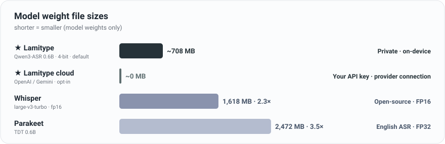

<p align="center">
  
</p>

<h1 align="center">Lamitype</h1>

<p align="center">
  <strong>Free, private, Traditional-Chinese-first Mac dictation that stays light on memory.</strong><br>
  Lamitype does one thing: turn your voice into text with minimal friction, privacy first.
</p>

<p align="center">
  <a href="https://github.com/felixfu824/Lamitype/releases/latest"></a>
  
  <a href="LICENSE"></a>
</p>

<p align="center">
  <strong>English</strong> | <a href="README.md">繁體中文</a>
</p>

<p align="center">
  Canonical repository: <a href="https://github.com/felixfu824/Lamitype">github.com/felixfu824/Lamitype</a><br>
  Official website: <a href="https://lamitype.com/en/">lamitype.com/en</a>
</p>

> **Lamitype** is a free, open-source, privacy-first speech-to-text app for macOS. By default it runs the **4-bit MLX quant** of Qwen3-ASR 0.6B fully locally on Apple Silicon, transcribing English, Chinese, Japanese, and mixed-language sentences, with consistent Traditional Chinese (繁體中文) output via OpenCC. **Cloud dictation (OpenAI / Gemini)** is an opt-in choice: your own key over HTTPS straight to the provider, with no relay server in between. Unlike dictation tools that force your audio through a third-party relay, Lamitype keeps the choice, and the privacy, in your hands. It also stays light enough to coexist with everything else you need running at once.

> 🌐 **Lamitype** 是一款免費、開源、隱私優先的 macOS 語音轉文字 App，預設使用 Qwen3-ASR 在 Apple Silicon（MLX）上完全本地執行，透過 OpenCC 提供道地的繁體中文輸出；也可選擇用你自己的金鑰直連 OpenAI / Gemini 雲端聽寫，中間沒有任何轉送伺服器。<br>→ 完整中文版 README：[README.md](README.md)

> **Name continuity:** Lamitype was formerly HushType. v0.5.12 renames the Mac app only; existing settings and Application Support data migrate automatically, while the iOS app and keyboard keep the HushType name in this release.

<p align="center">
  
</p>

<sub>Sizes are the weight files each tool ships at default precision; Lamitype's 675 MB is the 4-bit MLX quant of Qwen3-ASR 0.6B. On a cloud engine (OpenAI / Gemini) **model RAM is ~0 MB**: same or better quality, at the cost of a few seconds of network latency per utterance, billed by duration or free with a Gemini free-tier API key. A 4-bit MLX Whisper-turbo exists (~464 MB) but still outputs mediocre / Simplified Chinese, so the claim is "a light ASR that nails Traditional Chinese," not "the smallest model."</sub>

---

## Why Lamitype

**Privacy and control first.** In the default mode, voice never leaves your Mac: the model runs on-device, no cloud, no account, no telemetry; the only download is the one-time ~675 MB model fetch. When you opt into cloud dictation, audio goes over HTTPS **directly** to OpenAI or Gemini with **your own key**. No Lamitype server in between: nothing relayed, nothing intercepted, your audio and key never seen, and each session asks for your consent before the first cloud use. **Whether your audio goes to a provider is always your decision.**

**Memory-friendly: coexists with your agents.** The local model's weights are just ~675 MB (~2.1 GB RAM resident when loaded), light enough to coexist with Claude Code/Cowork, Codex and a browser, and Lamitype caps its memory buffer at launch so there's nothing for you to manage. Want the footprint at zero? Switch to a cloud engine: the local model is never loaded (the engine choice persists across restarts, so the next launch starts at ~0 MB); an already-loaded model can be unloaded with one menu click, and it reloads automatically when you switch back to local.

**Cloud dictation (opt-in).** Three things: (1) **OpenAI** (default `gpt-4o-mini-transcribe`) and **Gemini** (default `gemini-3.5-flash-lite`, with `gemini-3.7-flash` as the quality option), with your key, a direct connection, and no relay; (2) Gemini offers a **free-tier API key** for a $0 start, but note: on Google's free tier, Google may use submitted audio to improve its products; the paid tier does not; (3) built-in guardrails: per-session consent, a daily spend warning with same-day lockout (default $5), and over-long recordings blocked before upload.

**Traditional Chinese that actually works.** Whisper and most open-source models default to Simplified or Mainland phrasing (软件, not 軟體). Lamitype chains Qwen3-ASR with OpenCC `s2twp` for Taiwan-native output (軟體, 滑鼠, 品質) with EN/ZH code-switching in one pass and optional in-context number conversion (`一零一大樓` → `101 大樓`), on by default. Local and cloud engines share the same post-processing pipeline, so output quality is consistent.

**Fix text where it stands.** Select text in any app, double-tap Right ⌥, and an on-device Apple Intelligence model proofreads it and replaces it in place: spelling, grammar, typos, punctuation. It's a mechanical proofreader, not a rewriter: meaning, tone, and your 中英 mix stay exactly as you wrote them (macOS 26+).<br>Note: the Apple Foundation Model is small and capability-limited, so corrections are deliberately conservative; sometimes it changes nothing at all.

**Live captions, two flavors.** Local **Live Caption** runs the same on-device pipeline onto a floating panel: free, offline, works on a plane (decent quality). Opt-in **Live Translated Caption** streams audio to OpenAI's `gpt-realtime-translate` for real-time subtitles in 14 languages (high quality); your key (and your bill!), and it doesn't auto-start.

---

## Key Features

### Dictation

| Feature | Default | Requirement |
|---|---|---|
| Hold Right ⌥ to dictate (macOS) | ON | macOS 15+ |
| **Cloud dictation (OpenAI / Gemini, opt-in)**: zero model RAM, per-session consent | OFF | Your own API key |
| EN / ZH / JA + native code-switching | ON | - |

### Live Captions

| Feature | Default | Requirement |
|---|---|---|
| **Live Caption** (local, free): floating panel from mic or system audio | OFF | macOS 15+ |
| **Live Translated Caption** (cloud, ~$2/hr): real-time foreign-language subtitles via OpenAI | OFF (opt-in) | Your own OpenAI API key |

### Other Text-Related Features

| Feature | Default | Requirement |
|---|---|---|
| **Translate**: tap Right ⌥ to translate selected text | OFF | macOS 15+ |
| **Polish**: double-tap Right ⌥ to polish selected text (proofread in place) | **ON** | macOS 26 + Apple Intelligence |
| **Auto Polish**: proofread local dictation before it is inserted, with a per-app exclusion list | OFF | macOS 26 + Apple Intelligence |

### Output Post-Processing

| Feature | Default | Requirement |
|---|---|---|
| 簡體 → 繁體 post-processing (OpenCC `s2twp`) | **ON** | - |
| 阿拉伯數字 conversion (deterministic ITN) | **ON** | - |
| Chinese punctuation cleanup: trims the model's over-segmentation (soft / hard / off) | **soft** | - |
| Customized dictionary (proper nouns / jargon) | File-driven | - |

### Interface & Extras

| Feature | Default | Requirement |
|---|---|---|
| Interface Language (Follow System / English / 繁體中文) | Follow System | - |
| Floating "Listening / Transcribing" pill | ON | - |
| Unload speech-to-text model | One-click | - |
| iOS app + custom keyboard (experimental, untested; Mac as server) | Optional | iOS 17+, Python on Mac |

---

## Use Cases

**Talking to AI agents.** Giving Claude or ChatGPT a detailed prompt takes 5 minutes to type, 30 seconds to say. Hold Right ⌥, speak your entire prompt (mixing languages as needed), release, and text appears in the chat input. Local transcription means your prompts never leave your machine even if you're driving cloud-hosted agents.

**A memory-tight workday.** Three Claude Code sessions running, 20 browser tabs open, no appetite for one more resident model? Switch to the OpenAI or Gemini cloud engine in the menu: the local model stays unloaded, dictation keeps working, each utterance takes a second or two longer, and the cost lands on your own API bill (with a Gemini free-tier key: $0).

**Voice notes on the go.** On the subway, Mac at home. Tap "Start Listening" on iPhone, switch to Notes, tap the mic button on the HushType keyboard. Audio travels over Tailscale to your Mac, transcribes in ~1 second, text appears.<br>Honest note: the phone-side features have not been tested in a long while.

**Reading in another language.** Select any text in Safari, Mail, Notes, anywhere, and tap Right ⌥. A translucent card pops up with the translation via Apple's on-device Translation Framework. Auto-dismisses after 10s, pauses on hover. No API key, no cloud.

**Cleaning up text where you wrote it.** A dictated Slack reply, a comment typed too fast, a 中英 mixed sentence with a typo: select it, double-tap Right ⌥, and the corrected text lands back in place (and on the clipboard). No round-trip through a chatbot tab, and no risk of an AI "improving" your meaning: corrections only, everything else untouched.

**Watching foreign-language content.** Korean drama, Japanese news, Spanish football commentary. Open the source in any app, click **Live Translated Caption → From System Audio…** in the menu bar, pick the app, and translated English (or whichever target you set) streams onto a floating caption panel anchored at the bottom of your screen. Right ⌘ + / toggles it on and off. The original-language line shows above the translation as a confidence check; cost chip in the header tracks the session bill against your own OpenAI key.

---

## How It Works

```
macOS (local by default, zero network required):
  Hold Right Option (≥0.3s) → speak → release → text at cursor
  Tap Right Option (<0.3s) with text selected → translation card
  Double-tap Right Option with text selected → proofread in place (Text Polish)
  Local pipeline: mic → Qwen3-ASR (MLX, on-device) → OpenCC s2twp → ITN → paste
  Cloud pipeline (opt-in): mic → your Mac → HTTPS direct to OpenAI/Gemini → same OpenCC/ITN post-processing → paste
                           (no Lamitype server on the way)

iOS (via your Mac as server):
  Open HushType → Start Listening → switch to any app → HushType keyboard → tap mic
  Pipeline: iPhone mic → WiFi/Tailscale → Mac server → Qwen3-ASR → OpenCC → result back → text inserted
```

```
                                     ┌──────────────────────────────────┐
                                     │  Mac (Apple Silicon)             │
  ┌──────────────┐   WiFi/Tailscale  │                                  │
  │ iPhone       │ ──── HTTP POST ──►│  ios_server.py (port 8000)       │
  │ HushType KB  │◄── JSON result ───│    ↓                             │
  └──────────────┘                   │  mlx-audio (port 8199)           │
                                     │    → Qwen3-ASR 0.6B (MLX/Metal)  │
                                     │    → OpenCC s2twp                │
                                     │                                  │
                                     │  Lamitype.app (menu bar)         │
                                     │    → Right Option hotkey         │
                                     │    → Local transcription         │
                                     └──────────────────────────────────┘
```

---

## Install

### Option A: Download DMG (no build tools needed)

1. Download `Lamitype.dmg` from the [latest release](https://github.com/felixfu824/Lamitype/releases)
2. Open the DMG and drag Lamitype to Applications
3. Open Lamitype from Applications or Spotlight; its Developer ID signature and Apple notarization pass Gatekeeper directly
4. Grant **Accessibility**, **Microphone**, and **Screen & System Audio Recording** when needed
5. Wait for the model to download (~675 MB, one-time, progress shown in menu bar)

The DMG is self-contained: OpenCC and all dependencies are bundled. No Homebrew, no terminal commands.

> **iOS server support (untested):** The DMG also includes iOS server controls under **Settings… → iOS**. This feature is explicitly marked untested and requires Python 3 plus additional packages to be installed separately; see the [iOS setup guide](#setup-guide-ios-iphone--mac-server) below. If dependencies are missing, the app will show an error with the exact `pip3 install` command needed.

### Option B: Build from source

See [Prerequisites](#prerequisites-and-dependencies) and [macOS Setup Guide](#setup-guide-macos) below.

---

## Updating

Updating means **replacing the `.app` bundle**. Preferences, the ASR model, and user data live outside the bundle and are preserved.

**DMG:** quit and delete the old `/Applications/HushType.app`, drag the new `Lamitype.app` onto the Applications shortcut in the new DMG, then relaunch from Spotlight.

**From source:** `git pull && make install`.

**v0.5.12 rename transition:** the new Developer ID signing identity makes macOS reconfirm Accessibility, Microphone, and Screen & System Audio Recording independently once. The setup window shows their current state. If the old HushType Accessibility entry causes duplicates or a broken switch, use **Reset Old HushType Entry**, then add or enable Lamitype.

**Full uninstall:** Trash `/Applications/Lamitype.app`, then optionally run `defaults delete com.felix.hushtype` and remove `~/Library/Caches/qwen3-speech/models/aufklarer/Qwen3-ASR-0.6B-MLX-4bit/` to clear the macOS app's model cache. The iOS server uses a separate Python / Hugging Face cache.

---

## Prerequisites and Dependencies

> **Note:** If you installed via DMG (Option A), skip this section; everything is bundled. These are only needed for building from source or setting up the iOS server.

**Hardware and OS:**

| Requirement | Purpose |
|---|---|
| Mac with Apple Silicon (M1+) | MLX inference requires Metal GPU |
| macOS 15.0+ | Minimum OS for speech-swift |
| iPhone with iOS 17+ | iOS client (optional) |

**Software dependencies (build from source):**

| Dependency | Purpose | Install | Required for |
|---|---|---|---|
| [Homebrew](https://brew.sh) | Package manager | See brew.sh | Build from source |
| [opencc](https://formulae.brew.sh/formula/opencc) | Simplified → Traditional Chinese | `brew install opencc` | Build from source (bundled in DMG) |
| [speech-swift](https://github.com/soniqo/speech-swift) | Qwen3-ASR on Apple Silicon (MLX) | Automatic via SPM | Build from source |
| [Python 3.11+](https://python.org) (per mlx-audio) | iOS server runtime | `brew install python` | iOS only |
| [mlx-audio](https://github.com/Blaizzy/mlx-audio) | STT server for iOS | `pip3 install "mlx-audio[stt,server]"` | iOS only |
| [httpx](https://www.python-httpx.org/) | Async HTTP for proxy server | `pip3 install httpx` | iOS only |
| webrtcvad-wheels, setuptools | mlx-audio runtime deps | `pip3 install webrtcvad-wheels setuptools` | iOS only |
| [xcodegen](https://github.com/yonaskolb/XcodeGen) | iOS Xcode project generation | `brew install xcodegen` | iOS only |
| [Xcode 16+](https://developer.apple.com/xcode/) | Building the iOS app | Mac App Store | iOS only |
| [Tailscale](https://tailscale.com) | Encrypted iPhone-to-Mac from anywhere | See tailscale.com | Optional |

---

## Setup Guide: macOS

### Step 1: Clone and build

```bash
git clone https://github.com/felixfu824/Lamitype.git
cd Lamitype

# Install dependencies
brew install opencc

# Build and install to /Applications
make install
```

### Step 2: Launch and grant permissions

1. Launch Lamitype from Spotlight (Cmd+Space → Lamitype)
2. On first launch, the **Set Up Lamitype** window shows the required permissions: Accessibility and Microphone.
3. Click **Open System Settings** in the Accessibility card. Find Lamitype in the Accessibility list and **toggle it on**. If Lamitype is missing, use the small helper panel to drag Lamitype into the list.
4. Click **Allow Microphone** and approve the macOS microphone prompt.
5. Return to Lamitype and click **Restart Lamitype**: the app relaunches itself with the new Accessibility permission active. (macOS caches the permission check per-process, so a restart is mandatory after granting; Lamitype handles it for you.)
6. Wait for the model to download (~675 MB, one-time, progress shown in menu bar)

### Step 3: Use it

- **Hold Right Option (≥0.3s)**: record. A "Listening" pill with a live audio meter shows at the bottom of the screen.
- **Release**: pill switches to "Transcribing"; transcribed text pastes at your cursor and stays on the clipboard.
- **Tap Right Option (<0.3s)**: with text selected, translates via Apple Translation Framework into a floating card. See [Text Translation](#optional-text-translation).
- **Double-tap Right Option**: with text selected, proofreads and replaces it in place. See [Text Polish](#optional-text-polish-macos-26).

**Settings window (menu bar → Settings…):**

- **General**: interface language, floating indicator, and shortcuts
- **Dictation**: Local / OpenAI / Gemini engines and models, recognition language, Number Conversion, punctuation cleanup, and the customized dictionary
- **Caption**: caption panel, Live Translated Caption target language, and auto-stop time
- **Text**: Text Polish, Auto Polish for dictation (with the excluded-apps list), `polish_rules.txt`, and Text Translation
- **Cloud**: daily spend cap, today's usage, and OpenAI / Gemini key files
- **iOS**: the untested iOS server controls

The menu bar still provides quick toggles for Live Caption, Live Translated Caption, Text Translation, and Text Polish, plus **Unload Speech-to-Text Model** to free the local model's RAM and reload it from the same menu (~3s cold start).

That's it. The default mode needs no server, no network, no configuration.

### Optional: Cloud dictation (OpenAI / Gemini)

Same Right ⌥, same Traditional Chinese post-processing, but transcription happens on OpenAI or Gemini instead: **model RAM drops to zero**, quality is the same or better, at the cost of a few seconds of network latency per utterance and duration-based billing (Gemini free tier: $0).

1. **Get a key:** OpenAI at [platform.openai.com/api-keys](https://platform.openai.com/api-keys); Gemini at [aistudio.google.com/apikey](https://aistudio.google.com/apikey) (has a free tier).
2. **Enter the key:** menu bar → **Settings… → Cloud** → open the matching `openai.json` / `gemini.json` and paste the key into the `api_key` field. An empty key = cloud fully disabled.
3. **Pick engine and model:** menu bar → **Settings… → Dictation** → switch Local / OpenAI / Gemini. Defaults: OpenAI `gpt-4o-mini-transcribe` (with `gpt-transcribe` as an option); Gemini `gemini-3.5-flash-lite` (economical, free-tier friendly), with `gemini-3.7-flash` as the quality option.
4. **Consent and guardrails:** the first cloud transcription of each session shows a consent alert explaining that audio goes directly from your Mac to the provider (no relay server). The daily spend warning (default $5, adjustable 0.5-100) blocks a request **before** it would cross the threshold and locks cloud for the day; "Reset counter" unlocks it; over-long recordings are also blocked before upload. On a network timeout (180 s) you get three explicit choices: **Retry Cloud / Use Local Once / Cancel**. Your audio is preserved, and there is never a silent retry.
5. **The engine choice persists across restarts** (deliberate): if you live on cloud, the local model is never loaded at the next launch; model RAM starts at 0. Switching back to local reloads the model automatically.

> **Gemini free-tier reminder:** on Google's free tier, Google may use submitted audio to improve its products; the paid tier does not. The in-app consent alert discloses this.

### Optional: Live Caption / Live Translated Caption (macOS 15+)

Two products sharing the same floating caption panel. Mutually exclusive at runtime: starting one auto-stops the other.

**Live Caption** (free, local, on-device):

1. Status-bar menu → click **Live Caption** to toggle (uses last-known source, defaults to mic on first use), or pick **From Microphone** / **From System Audio…** explicitly.
2. System Audio first time → pick the app whose audio you want to caption from the picker.
3. Captions stream onto a floating panel pinned near the bottom of your screen. The panel is draggable and resizable; its frame is remembered across stops.

**Live Translated Caption** (~$2/hr against your own OpenAI account):

1. Get an API key at https://platform.openai.com/api-keys.
2. Status-bar menu → **Settings… → Cloud** → click **Open file in TextEdit** beside the OpenAI key and paste your key into `openai.json` as the `api_key` field.
3. Go to **Settings… → Caption** and pick a target language (default: English; 13 others including 繁體中文 / 简体中文 / 日本語 / 한국어 / Español / Français / Deutsch).
4. Click **Live Translated Caption → From Microphone** (or **From System Audio…**) in the menu. First time you do this, a one-time disclosure modal explains the cost and privacy profile; accept once and it stays accepted.
5. A cost chip in the caption panel header (e.g. `12:34 · $0.42`) shows session duration and spend. Configure auto-stop minutes under **Settings… → Caption** and the daily spend cap under **Settings… → Cloud**.

**Hotkey** (both products): Right ⌘ + / toggles **whichever product you last started**. First-use default is local (Live Caption). The menu items are the authoritative way to pick a specific product + source.

**Mid-session switching:** Clicking the other product's menu item while one is running auto-stops the current session and starts the new one. Clicking the same product's other source switches in place without rebuilding the panel.

### Optional: Text Translation

On-device translation via Apple Translation Framework. Select any text → tap Right Option (<0.3s) → translucent card appears with the translation, also auto-copied to clipboard. Card auto-dismisses after 10s; hover to pause, click or Escape to dismiss now.

**Direction:** Chinese → English; everything else → Traditional Chinese. Override via menu bar or `defaults write hushtype.translateTargetLanguage`.

**Enable:** Menu bar → **Text Translation**. The toggle runs a sanity-check; if Translation Framework isn't available, the toggle stays off with a clear error.

### Optional: Text Polish (macOS 26+)

On-device proofreading via Apple's Foundation Models framework: the Apple Intelligence model already shipped with macOS, so it adds nothing to Lamitype's memory budget and nothing leaves your Mac. Select text in any app → double-tap Right Option → the selection is replaced in place with corrected text, and a result card shows exactly what changed, Word track-changes style: deletions struck through in red, insertions underlined in green.

<p align="center">
  
</p> When a correction was made, the polished text also stays on the clipboard, so read-only views (a web page, a PDF) work too: select, double-tap, paste it wherever you want. Already-correct text gets a "No changes needed" card and your clipboard is left alone. Also in the right-click menu: **Services → Polish with Lamitype**.

**What it fixes, and what it never touches.** Spelling, grammar, punctuation, obvious typos. It is deliberately a mechanical proofreader, not a rewriter: meaning, tone, formatting, casing, and language mix are preserved. The rules it is held to:

- **Never translates.** A 中英 mixed sentence stays mixed. If the model drops one of your languages, Lamitype detects it on the output, retries once with a stronger instruction, and shows an alert rather than paste a mistranslation.
- **Never converts** Simplified ↔ Traditional Chinese in either direction.
- **Never answers.** A selection shaped like a question or an instruction is text to proofread, not a prompt to obey.
- **Declines code.** Code-shaped selections are refused with an alert; URLs, file paths, and backtick content inside normal text are left as-is.
- **Fails loudly, never silently.** If the model output looks corrupted (wrong length, dropped language), you get an alert and your text stays exactly as it was.

**Honest limits:** this runs on Apple's small on-device model, and the trade-offs show: **English corrections are the most reliable**; **Chinese fixes are conservative** and syntax-dependent typos (的/得, 在/再) are often missed; **longer selections tend to come back "No changes needed"**; one or two sentences at a time works best. That bias is deliberate: when the model is unsure it returns your text unchanged; it would rather miss a fix than make one up.

**Speed:** typically ~1-3 s. Lamitype keeps a prewarmed model session on standby, so the prompt-processing cost is paid before you double-tap, not after.

**Custom rules:** menu bar → **Settings… → Text → Polish instructions → Open file in TextEdit** opens `~/Library/Application Support/Lamitype/polish_rules.txt`. One short imperative rule per line (`#` for comments), merged into the built-in prompt, e.g. `Use the Oxford comma.` or `一律用台灣用語`. Saves hot-reload; no restart.

**Auto Polish for dictation (v0.5.13+, off by default):** menu bar → **Settings… → Text**, check "Polish dictated text automatically", and every local dictation result runs through the same on-device proofread (same `polish_rules.txt`) before it reaches your cursor, so what gets inserted is already corrected. Only the text from that utterance is touched; nothing else in the field. If polishing fails, trips an output guard, or takes more than 8 seconds, the raw transcript is inserted as-is with no alert: an unpolished sentence beats a lost one. For apps where you never want corrections (a terminal, say), add them under "Excluded apps → Choose Apps…"; everywhere else stays polished. Local engine only; OpenAI / Gemini dictation skips this step. Adds roughly 0.7 to 1.5 s per utterance.

**Requirements:** macOS 26 (Tahoe) + Apple Intelligence enabled + Apple Silicon. On by default; on Macs without Foundation Models the double-tap stays inactive, and the **Services → Polish with Lamitype** entry reports why. Toggle from the menu bar (**Text Polish**) or via `defaults`.

## Setup Guide: iOS (iPhone + Mac Server)

The iOS app and server are experimental and untested. They use your Mac as the transcription server: your iPhone sends audio to your Mac over WiFi or Tailscale and receives the transcribed text back. The server uses port `8000` and cannot run alongside Live Caption.

### Step 1: Install server dependencies on Mac

```bash
# Python packages for the transcription server
pip3 install "mlx-audio[stt,server]" webrtcvad-wheels setuptools httpx

# OpenCC for Traditional Chinese + xcodegen for iOS project
brew install opencc xcodegen
```

### Step 2: Get your Mac's IP address

```bash
# If using Tailscale (works from anywhere):
tailscale ip -4
# Example output: 100.x.x.x

# If using LAN only (same WiFi):
ipconfig getifaddr en0
# Example output: 192.168.50.50
```

Write down this IP; you'll enter it on your iPhone later.

### Step 3: Start the iOS server on Mac

**Option A: From Lamitype Settings (untested)**
Click the Lamitype icon in the menu bar → **Settings… → iOS → Start iOS server (untested)**

**Option B: From terminal**
```bash
cd Lamitype
python3 scripts/ios_server.py
# Server starts on 0.0.0.0:8000
# First transcription request will download the model (~675 MB)
```

Verify the server is running:
```bash
curl http://localhost:8000/
# Should return: {"status":"ok","service":"Lamitype iOS Server","opencc":true}
# (opencc:false means `brew install opencc` is still missing)
```

### Step 4: Build and install the iOS app

```bash
cd iOS
xcodegen generate
open Lamitype.xcodeproj
```

In Xcode:
1. Click the **Lamitype** project in the navigator (top left)
2. Select the **Lamitype** target → Signing & Capabilities → set **Team** to your Apple ID
3. Select the **LamitypeKeyboard** target → same thing, set **Team**
4. If Xcode shows "Update to recommended settings" → click **Perform Changes**
5. Connect iPhone via USB cable
6. Select your iPhone as the run destination (top bar)
7. Click **Run** (Cmd+R)

First-time build takes ~1 minute. Subsequent builds are faster.

### Step 5: Set up iPhone

These steps happen on the iPhone itself:

**5a. Enable Developer Mode** (one-time):
1. Settings → Privacy & Security → Developer Mode → toggle **On**
2. iPhone will restart. After restart, confirm "Turn On" when prompted.

**5b. Trust the developer** (one-time):
1. Settings → General → VPN & Device Management
2. Tap your Apple ID under "Developer App"
3. Tap **Trust**

**5c. Add the HushType keyboard** (one-time):
1. Settings → General → Keyboard → Keyboards → **Add New Keyboard**
2. Scroll down to "Third-Party Keyboards" → tap **HushType**
3. Tap **HushType** in the keyboard list → toggle **Allow Full Access** → confirm

> **Important:** Full Access must be enabled. Without it, the keyboard cannot communicate with the main app or access the network. If the mic button doesn't respond, this is the most common cause.

### Step 6: Configure and test

1. Open the **HushType** app on iPhone
2. Enter your Mac's IP address: `http://<your-ip>:8000` (the IP from Step 2)
3. Tap **Test Connection** → should show green "Connected"
4. Tap **Start Listening**: the orange microphone indicator appears at the top of the screen
5. The app shows a 5-minute countdown timer

### Step 7: Use it

1. Switch to any app (Messages, Notes, Safari, etc.)
2. Long-press the **globe key** on your keyboard → select **HushType**
3. Tap the **mic button** → speak → tap **stop**
4. Wait 1-2 seconds → transcribed text appears at your cursor
5. Use **space**, **backspace**, and **return** buttons for basic editing

When the 5-minute session expires, return to the HushType app and tap "Start Listening" again.

### After setup: Daily usage

You only need to repeat Steps 3 + 6-7 each day:
1. Make sure the iOS server is running on Mac (menu bar → **Settings… → iOS**)
2. Open HushType on iPhone → Start Listening
3. Switch to your app → use the keyboard

The USB cable is only needed for installing/updating the app from Xcode. Normal usage is wireless.

> **Note:** With free Apple ID provisioning, the app expires every 7 days. When it stops launching, reconnect USB → Xcode → Cmd+R to reinstall. Your settings are preserved. A paid Apple Developer account ($99/year) extends this to 1 year.

---

## Configuration

### macOS

```bash
# View all settings
defaults read com.felix.hushtype

# Language: nil=auto, "english", "chinese", "japanese"
defaults write com.felix.hushtype hushtype.language -string "chinese"

# Model: macOS default "aufklarer/Qwen3-ASR-0.6B-MLX-4bit" (0.6B, 4-bit MLX quant);
# alternative "mlx-community/Qwen3-ASR-1.7B-8bit" for better quality.
defaults write com.felix.hushtype hushtype.modelId -string "mlx-community/Qwen3-ASR-1.7B-8bit"

# Dictation engine: "local" (default) / "openai" / "gemini"; persists across restarts
defaults write com.felix.hushtype hushtype.dictationEngine -string "local"

# Cloud dictation models (remembered per provider)
defaults write com.felix.hushtype hushtype.cloudDictationModelOpenAI -string "gpt-4o-mini-transcribe"
defaults write com.felix.hushtype hushtype.cloudDictationModelGemini -string "gemini-3.5-flash-lite"

# Traditional Chinese conversion (default: true)
defaults write com.felix.hushtype hushtype.chineseConversionEnabled -bool false

# Number conversion / ITN: Chinese numeral → Arabic digit (default: true)
defaults write com.felix.hushtype hushtype.numberConversionEnabled -bool false

# Floating "Listening / Transcribing" indicator (default: true)
defaults write com.felix.hushtype hushtype.floatingOverlayEnabled -bool false

# Text Polish: double-tap Right ⌥ proofreads selected text in place
# (default: true, requires macOS 26 + Apple Intelligence)
defaults write com.felix.hushtype hushtype.textPolishEnabled -bool false

# Auto Polish: proofread local dictation before it is inserted
# (default: false, requires macOS 26 + Apple Intelligence)
defaults write com.felix.hushtype hushtype.autoPolishDictationEnabled -bool true

# Apps excluded from Auto Polish (array of bundle identifiers, default: empty)
defaults write com.felix.hushtype hushtype.autoPolishExcludedBundleIDs -array com.apple.Terminal com.googlecode.iterm2

# Text Translation via Apple Translation Framework (default: false)
defaults write com.felix.hushtype hushtype.textTranslationEnabled -bool true

# Translation target language (default: nil = auto; Chinese→English, other→繁體中文)
# Set to a specific language code to override (e.g., "en", "zh-Hant-TW", "ja")
defaults write com.felix.hushtype hushtype.translateTargetLanguage -string "en"
```

### iOS

- Server URL: configured in the app UI (persisted in App Group)
- Session duration: 5 minutes (hardcoded in BackgroundAudioManager.swift)
- Model: `mlx-community/Qwen3-ASR-0.6B-4bit` (hardcoded in RemoteTranscriber.swift)

### Changing the Hotkey (macOS)

Edit `Sources/Lamitype/HotkeyManager.swift`:
```swift
private static let rightOptionKeyCode: Int64 = 61
```

Common keycodes: Right Option (61), Right Command (54), Left Option (58), Left Control (59), Fn/Globe (63).

---

## Privacy & Security

Two modes, one principle: **there is never a third party in the middle, and the decision is always yours.**

### Local mode (default)

- **No audio is stored.** Voice data exists only in RAM during the recording → transcription pipeline, then discarded. Nothing is written to disk: not on macOS, not on the iOS server.
- **No network after setup.** The only internet access is the one-time model download (~675 MB) on first launch. After that, the app and the model run fully offline with zero outbound connections.
- **No telemetry.** No analytics, no usage tracking, no phone-home. The macOS app contains zero local-mode network code beyond the initial model fetch (handled by the HuggingFace Hub SDK inside speech-swift) and an optional GitHub releases check for update notifications.
- **Fully air-gappable.** Prepare the model folder on another machine (`~/Library/Caches/qwen3-speech/models/aufklarer/Qwen3-ASR-0.6B-MLX-4bit/` for the macOS app; the Python / iOS server has a separate Hugging Face cache at `~/.cache/huggingface/hub/models--mlx-community--Qwen3-ASR-0.6B-4bit/`) and copy it over; the app will never need internet.

### Cloud mode (opt-in: cloud dictation / Live Translated Caption)

- **No relay server in the middle.** Audio goes directly from your Mac over HTTPS (WSS for captions) to the provider (OpenAI / Google). Lamitype operates no servers, intermediates no traffic, and never sees your audio, your key, or your spend.
- **Your key, your consent.** Everything is off by default and requires you to enter a key; each session asks for consent before the first cloud use; never a silent upload. An empty key disables cloud entirely.
- **Key storage.** Keys live in `~/Library/Application Support/Lamitype/` (`openai.json` / `gemini.json`); the app sets `0600` file permissions on write (the same security model as a `.env` file).
- **Spend guardrails.** The daily spend warning (default $5) blocks a request before it would cross the threshold and locks cloud for the day; over-long recordings are blocked before upload and never sent.
- **Gemini free-tier disclosure.** On Google's free tier, Google may use submitted audio to improve its products; the paid tier does not.
- **State semantics.** The dictation engine choice persists across restarts (so cloud users stay at zero model RAM). The caption engine flag resets to local each launch, but Right ⌘ + / remembers the **last caption mode you used (cloud included)**, and the one-time cloud disclosure does not repeat: if your last session was Live Translated Caption, the hotkey starts a paid cloud session again after a relaunch.
- **iOS audio stays on your network.** iPhone audio travels directly to your Mac over local WiFi or Tailscale (WireGuard-encrypted), never through a third-party server; the iOS server always uses the local model.

---

## Project Structure

```
Lamitype/
├── Package.swift                      SPM config (macOS target)
├── Makefile                           build / install / clean / dmg
├── Sources/Lamitype/                  macOS menu bar app
│   ├── main.swift                     NSApplication bootstrap
│   ├── AppDelegate.swift              Orchestrator + state machine
│   ├── StatusBarController.swift      Menu bar icon + menus + Settings routing
│   ├── IOSServerManager.swift         Manages ios_server.py subprocess
│   ├── OnboardingManager.swift        First-launch / repair permission orchestration
│   ├── OnboardingSetupWindowController.swift  Setup window for Accessibility + Microphone
│   ├── PermissionSettingsGuidePanel.swift     Floating helper for macOS permission lists
│   ├── DraggableAppTileView.swift     Draggable Lamitype.app tile for System Settings
│   ├── SystemAudioPermissionFlow.swift        Screen & System Audio permission flow
│   ├── SystemAudioPermissionWindowController.swift  System-audio permission setup panel
│   ├── HotkeyManager.swift            CGEvent tap for Right Option
│   ├── AudioCaptureService.swift      AVAudioEngine mic capture (16kHz mono, RMS publisher)
│   ├── TranscriptionEngine.swift      Throwing engine protocol + local Qwen3ASR engine (MLX)
│   ├── OpenAITranscribeEngine.swift   Cloud dictation engine: OpenAI (HTTPS direct)
│   ├── GeminiTranscribeEngine.swift   Cloud dictation engine: Gemini (HTTPS direct)
│   ├── CloudUsageTracker.swift        Daily spend metering + pre-upload cap enforcement
│   ├── CloudDictationOnboardingAlert.swift  Per-session cloud dictation consent
│   ├── Settings/                         Unified seven-tab Settings UI
│   │   ├── SettingsWindowController.swift  Window controller + tab routing
│   │   ├── GeneralPane.swift             General preferences + permissions
│   │   ├── DictationPane.swift           Dictation engine + recognition settings
│   │   ├── CaptionPane.swift             Caption panel + translated-caption settings
│   │   ├── TextPane.swift                Text Polish, Auto Polish + Translation settings
│   │   ├── CloudPane.swift               Spend guardrails + provider keys
│   │   ├── IOSServerPane.swift           Experimental iOS server controls
│   │   └── AboutPane.swift               Version, project links, update check
│   ├── GeminiKeyStore.swift           User Gemini API key file handling (0600)
│   ├── ChineseConverter.swift         OpenCC s2twp (Simplified → Traditional)
│   ├── NumberNormalizer.swift         Deterministic Chinese-numeral → Arabic-digit ITN
│   ├── DictionaryReplacer.swift       Customized dictionary (final post-processing step)
│   ├── TextInserter.swift             Clipboard + Cmd+V paste (result persists on clipboard)
│   ├── TextPolisher.swift             Text Polish orchestration + output guards
│   ├── AutoPolishPolicy.swift         Auto Polish decision (toggle, engine, excluded apps)
│   ├── DictationPolishStage.swift     Polish-before-insert stage with raw-transcript fallback
│   ├── AutoPolishExclusionPicker.swift Excluded-apps picker for Auto Polish
│   ├── FoundationModelsPolisher.swift macOS 26+ Apple FM proofread (prewarmed session pool)
│   ├── PolishPrompt.swift             Proofread-only prompt + polish_rules.txt merge
│   ├── PolishCardWindow.swift         Floating polish result card NSPanel
│   ├── PolishCardView.swift           SwiftUI polish result card view
│   ├── InputSourceManager.swift       CJK input method detection
│   ├── FloatingOverlayWindow.swift    Borderless NSPanel for the listening pill
│   ├── FloatingOverlayView.swift      SwiftUI pill: RMS bars + transcribing spinner
│   ├── TranslationManager.swift       Apple Translation Framework integration
│   ├── TranslationCardWindow.swift    Floating translation card NSPanel
│   ├── TranslationCardView.swift      SwiftUI translation card view
│   ├── LiveCaptionManager.swift       Local/cloud live caption orchestration
│   ├── LiveCaptionWindow.swift        Floating live caption panel
│   ├── LiveCaptionView.swift          SwiftUI live caption panel view
│   ├── LiveCaptionWorker.swift        Streaming local ASR worker
│   ├── LocalQwen3Backend.swift        Local Live Caption backend
│   ├── OpenAITranslateBackend.swift   Cloud translated-caption backend
│   ├── OpenAIKeyStore.swift           User OpenAI API key file handling
│   ├── CloudOnboardingAlert.swift     One-time cloud disclosure
│   ├── SystemAudioSource.swift        ScreenCaptureKit system-audio source
│   ├── SystemAudioPicker.swift        App/source picker for system audio
│   ├── MemoryUtils.swift              Process memory reading utilities
│   └── AppConfig.swift                UserDefaults wrapper
├── scripts/
│   ├── ios_server.py                  FastAPI proxy: mlx-audio + OpenCC
│   └── build_mlx_metallib.sh          MLX Metal shader compilation
├── Resources/
│   ├── Info.plist                     LSUIElement, mic usage description
│   ├── Lamitype.png                   App icon (1024x1024)
│   └── Lamitype.icns                  macOS app icon
└── iOS/                               iPhone app + keyboard extension
    ├── project.yml                    xcodegen project spec
    ├── Shared/                        Shared between app + keyboard extension
    │   ├── AppGroupConstants.swift    App Group keys + file-based IPC
    │   ├── IPCConstants.swift         Darwin notification names
    │   └── WAVEncoder.swift           Float32 → 16-bit PCM WAV
    ├── VoxKey/                        Main iOS app (directory name kept from v1)
    │   ├── VoxKeyApp.swift            SwiftUI entry point (@main LamitypeApp)
    │   ├── Views/ContentView.swift    Server config, listening session, countdown
    │   ├── Services/
    │   │   ├── AudioRecorder.swift    AVAudioEngine with listening + recording modes
    │   │   ├── BackgroundAudioManager.swift  Session timer, IPC polling, background
    │   │   └── RemoteTranscriber.swift       HTTP multipart POST to Mac server
    │   ├── Assets.xcassets/           App icon asset catalog
    │   └── Resources/silence.wav      Background audio fallback
    └── VoxKeyKeyboard/                Custom keyboard extension
        └── KeyboardViewController.swift  Mic, space, backspace, return, globe
```

## Customizing for Your Own Setup

To run Lamitype on your own devices, change these:

| What | Where | Example |
|---|---|---|
| Bundle ID | `iOS/project.yml` (both targets) + `iOS/Shared/AppGroupConstants.swift` | `com.yourname.hushtype` / `group.com.yourname.hushtype` |
| Server URL default | `iOS/VoxKey/Views/ContentView.swift` | Your Tailscale or LAN IP |
| Hotkey | `Sources/Lamitype/HotkeyManager.swift` | Any modifier keycode |
| Model | `iOS/VoxKey/Services/RemoteTranscriber.swift` + `scripts/ios_server.py` | `mlx-community/Qwen3-ASR-1.7B-8bit` for better quality |
| Session timeout | `iOS/VoxKey/Services/BackgroundAudioManager.swift` | `sessionDuration` property |
| OpenCC config | `Sources/Lamitype/ChineseConverter.swift` + `scripts/ios_server.py` | Change `s2twp` to `s2t` for standard Traditional |

---

## Troubleshooting

**macOS: "MLX error: Failed to load the default metallib"**
Run: `bash scripts/build_mlx_metallib.sh release`

**macOS: Hotkey not working**
Check Accessibility permission in System Settings → Privacy & Security → Accessibility. Lamitype must be in the list and toggled on. If Lamitype is missing or the switch does not work, relaunch Lamitype and use **Reset Old Lamitype Entry** from the setup window, then add/enable Lamitype again. If you just granted Accessibility and the hotkey still does not work, click **Restart Lamitype** in the setup window or quit and relaunch manually; macOS caches the permission check per-process.

**iOS: "App Transport Security" error**
The Info.plist must have `NSAllowsArbitraryLoads = true` with NO `NSExceptionDomains`; they conflict and cause iOS to ignore the global allow.

**iOS: Mic button does nothing (no recording starts)**
Most common cause: **Full Access is not enabled**. Go to Settings > General > Keyboard > Keyboards > HushType > toggle Allow Full Access. Without this, the keyboard extension cannot communicate with the main app.

**iOS: Keyboard stuck on "Transcribing..."**
The main app isn't receiving commands. Ensure:
1. HushType app is open and showing "Listening" with the orange mic dot
2. The Mac server is running (`curl http://<mac-ip>:8000/`)
3. App Group container works (check Xcode console for "App Group container: /path...")

**iOS: "Open HushType app first"**
The main app isn't running or the listening session expired (5-min timeout). Open HushType app and tap "Start Listening" again.

**iOS: App stops working after 7 days**
Free provisioning signing expires. Reconnect iPhone via USB, open Xcode, Cmd+R to reinstall. Settings are preserved.

**Server: Port already in use**
```bash
lsof -ti :8000 :8199 | xargs kill
```

---

## Known Limitations

- iOS requires Mac to be on and server running (no cloud fallback)
- Free provisioning: iOS app expires every 7 days (re-sign via Xcode)
- Session timeout is fixed at 5 minutes (no UI to change yet)
- Mac must be reachable from iPhone (same WiFi or Tailscale)
- The DMG app is Developer ID signed and Apple notarized, so it passes Gatekeeper directly.
- Text Polish inherits Apple Foundation Models limits: a few fine-grained Chinese distinctions (e.g. 的/得/地) may be left as-is, and heavily English-dominant mixed sentences can be declined with an alert rather than risk a mistranslation. Declined always means your text is untouched.
