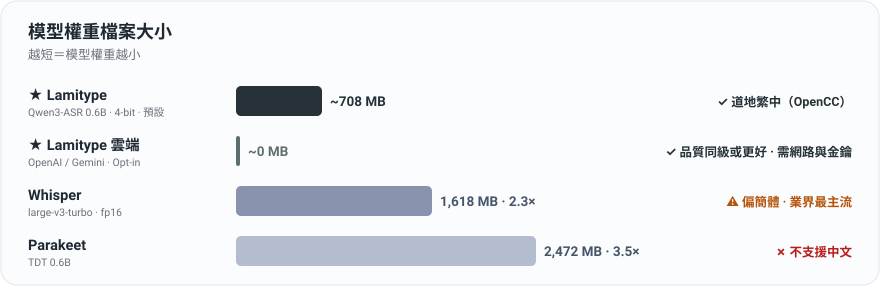

<p align="center">
  
</p>

<h1 align="center">Lamitype</h1>

<p align="center">
  <strong>免費、隱私、繁體中文優先、不霸佔記憶體的 Mac 語音輸入</strong><br>
  Lamitype 只做一件事：在隱私優先的前提下，讓你的聲音以最小的摩擦變成文字。
</p>

<p align="center">
  <a href="https://github.com/felixfu824/Lamitype/releases/latest"></a>
  
  <a href="LICENSE"></a>
</p>

<p align="center">
  <a href="README.en.md">English</a> | <strong>繁體中文</strong>
</p>

<p align="center">
  官方 repository：<a href="https://github.com/felixfu824/Lamitype">github.com/felixfu824/Lamitype</a><br>
  官方網站：<a href="https://lamitype.com/">lamitype.com</a>
</p>

> **Lamitype** 是一款免費、開源、隱私優先的 macOS 語音轉文字 App。預設使用 Qwen3-ASR 0.6B 的 **4-bit MLX 量化版**在 Apple Silicon 上完全本地執行，支援英文、中文、日文的語音輸入，支援混用多語的句子，並透過 OpenCC 提供穩定的繁體中文輸出；也可**選擇雲端聽寫（OpenAI / Gemini）**：用你提供的金鑰經 HTTPS 直連供應商，中間沒有任何轉送伺服器。相對強迫你把音訊交給第三方的聽寫工具，Lamitype 把選擇權和隱私主導權留在你手上，並專注保持輕量，與你需要同時跑的所有 App 共存。

> 🌐 **Lamitype** is a free, local-first dictation app for Apple Silicon Macs. It runs Qwen3-ASR (4-bit) locally via MLX for English, Chinese, Japanese, and others, and supports mixed-language sentences with genuinely native Traditional Chinese output (via OpenCC). Cloud dictation (OpenAI / Gemini) is an opt-in choice: your own key, a direct connection, and no middleman; privacy choices stay in your hands either way.<br>→ Read the full English README: [README.en.md](README.en.md)

> **名稱延續：** Lamitype formerly HushType。v0.5.12 只更名 Mac App；現有設定與 Application Support 資料會自動搬移，iOS App 尚未調整。

<p align="center">
  
</p>

<sub>數字為各工具預設精度的模型權重大小；Lamitype 的 675 MB 是 Qwen3-ASR 0.6B 的 4-bit MLX 量化版。選用雲端引擎（OpenAI / Gemini）時**模型記憶體 ~0 MB**，品質同級或更好，代價是每句多幾秒的網路延遲，依時長計費或使用 Gemini 免費（Free tier）API Key。另有 4-bit Whisper-turbo（約 464 MB），但中文輸出仍偏簡體、品質平庸，所以我們的定位是「能做出道地繁中的輕量 ASR」，而非「最小的模型」。</sub>

---

## 為什麼選擇 Lamitype

**隱私與主導權優先。** 預設模式下語音永遠不離開你的 Mac，模型完全在本機執行，無雲端、無帳號、無使用追蹤，只有首次一次性模型下載（約 675 MB）。選擇加入雲端聽寫時，音訊用**你自己的金鑰**經 HTTPS **直連** OpenAI 或 Gemini：中間沒有 Lamitype 伺服器，不經手、不攔截、看不到你的音訊與金鑰，且每個工作階段第一次使用前都會先徵求你的同意。**要不要把音訊交給供應商，永遠是你的決定。**

**記憶體友善：與你的 AI 助手共存。** 本機模型權重只有約 675 MB（載入後常駐約 2.1 GB RAM），輕到能與 Claude Code/Cowork、Codex、瀏覽器同機共存，且 Lamitype 啟動時就替記憶體暫存設上限，你完全不用管。想把記憶體占用歸零？切到雲端引擎：本機模型不會載入（引擎選擇跨重啟保留，下次啟動就是 ~0 MB 起步）；已載入的模型也可以在選單一鍵卸載，切回本機引擎時自動重新載入。

**雲端聽寫（Opt-in）。** 三件事：(1) 支援 **OpenAI**（預設 `gpt-4o-mini-transcribe`）與 **Gemini**（預設 `gemini-3.5-flash-lite`，可選 `gemini-3.7-flash`），你的金鑰、直連、無轉送；(2) Gemini 有**免費（Free tier）API Key** 可零成本入門；但請注意：Google 免費方案可能用你提交的音訊改進其產品，付費方案則不會；(3) 內建護欄：逐次同意、每日花費警示與當日鎖定（預設 $5）、錄音過長在上傳前就擋下。

**真正能用的繁體中文。** Whisper 與多數開源模型預設輸出簡體或大陸用語（软件 而非 軟體）。Lamitype 串接 Qwen3-ASR 與 OpenCC `s2twp` 做台灣在地輸出，軟體、滑鼠、品質，支援英中同句混用辨識，並可選擇將中文數字依語境轉成阿拉伯數字（`一零一大樓` → `101 大樓`），預設開啟。本機與雲端引擎共用同一套後處理管線，輸出品質一致。

**文字就地修正。** 在任何 App 選取文字、雙擊 Right ⌥，裝置端 Apple Intelligence 模型直接就地校對並替換：錯字、文法、標點。它是機械式校對員，不是改寫器：語意、語氣、中英混用全都原樣保留（macOS 26+）。<br>註：Apple Foundation Model 參數較少能力受限，故目前校正選擇較保守，有時可能會完全不改動。

**字幕兩種模式。** 本機 **Live Caption（即時字幕）** 用同一套裝置端管線把字幕顯示在浮動面板上：免費、離線、飛機上也能用（品質普通）。可選的 **Live Translated Caption（即時翻譯字幕）** 把音訊串到 OpenAI 的 `gpt-realtime-translate`，即時產生 14 種語言的字幕（高品質），金鑰是你的（帳單也是你的！），不自動啟動。

---

## 主要功能

### 語音輸入（Dictation）

| 功能 | 預設 | 系統需求 |
|---|---|---|
| 按住 Right ⌥ 進行語音輸入（macOS）| ON | macOS 15+ |
| **雲端語音輸入（OpenAI / Gemini，Opt-in）**：零模型記憶體，逐次同意 | OFF | 你自己的 API 金鑰 |
| 英文 / 中文 / 日文 + 原生混用 | ON | - |

### 即時字幕（Live Captions）

| 功能 | 預設 | 系統需求 |
|---|---|---|
| **Live Caption（本機，免費）**：浮動字幕面板，麥克風或系統音訊 | OFF | macOS 15+ |
| **Live Translated Caption（雲端，約 $2/小時）**：即時外文翻譯字幕，使用 OpenAI | OFF（自行開啟） | 你自己的 OpenAI API key |

### 其他文字相關功能（Other Text-Related Features）

| 功能 | 預設 | 系統需求 |
|---|---|---|
| **翻譯**：輕按 Right ⌥ 翻譯選取的文字 | OFF | macOS 15+ |
| **校對**：雙擊 Right ⌥ 校對選取的文字，就地修正 | **ON** | macOS 26 + Apple Intelligence |
| **自動校對聽寫文字**：本機聽寫結果插入前先經同一個校對流程，可排除特定 App | OFF | macOS 26 + Apple Intelligence |
| **校對實驗室**：檢視差異、用指示重跑、標記並匯出本機校對案例 | 每次啟動皆為 OFF | 重跑需 macOS 26 + Apple Intelligence |

### 文字輸出調教（Output Post-Processing）

| 功能 | 預設 | 系統需求 |
|---|---|---|
| 簡體 → 繁體 後處理（OpenCC `s2twp`）| **ON** | - |
| 阿拉伯數字轉換（確定性 ITN）| **ON** | - |
| 中文標點清理，修剪模型過度斷句（soft / hard / off）| **soft** | - |
| 自訂字典（專有名詞 / 行話）| 檔案驅動 | - |

### 介面與其他（Interface & Extras）

| 功能 | 預設 | 系統需求 |
|---|---|---|
| 介面語言（跟隨系統 / English / 繁體中文）| 跟隨系統 | - |
| 浮動「Listening / Transcribing」指示條 | ON | - |
| 卸載語音轉文字模型 | 一鍵 | - |
| iOS App + 自訂鍵盤（實驗性、尚未測試，以 Mac 為伺服器）| 選用 | iOS 17+、Mac 上需有 Python |

---

## 使用情境

**與 AI 助手對話。** 給 Claude 或 ChatGPT 一段詳細的 prompt，打字要 5 分鐘，用說的只要 30 秒。按住 Right ⌥，自然地說完整段 prompt（可任意混用語言）、放開，文字立刻出現在聊天輸入框中。本地轉錄意味著：即使你正在使用雲端託管的 AI 助手，你的 prompt 也不會離開你的機器。

**記憶體吃緊的工作日。** Claude Code 跑三個 session、瀏覽器開 20 個分頁，不想再多一個常駐模型？選單切到 OpenAI 或 Gemini 雲端引擎，本機模型保持卸載、聽寫照用，每句多等一兩秒、費用記在你自己的 API 帳單上（若使用 Gemini Free-tier API Key：$0）。

**通勤時的語音筆記。** 在捷運上，Mac 留在家裡。在 iPhone 上點「Start Listening」，切到備忘錄，按 HushType 鍵盤上的麥克風按鈕。語音透過 Tailscale 傳回你的 Mac，約 1 秒完成轉錄，文字出現。<br>誠實註記：手機端功能已許久未測試。

**閱讀其他語言。** 在 Safari、Mail、備忘錄等任何 App 中選取文字，輕按 Right ⌥。半透明卡片即跳出翻譯結果，使用 Apple 裝置端 Translation Framework。10 秒後自動關閉、游標停留會暫停倒數。無 API 金鑰、無雲端。

**在原地把文字改對。** 語音輸入的 Slack 回覆、打太快滿是錯字的留言、有 typo 的中英夾雜句，選取、雙擊 Right ⌥，修正後的文字直接落回原處（同時保留在剪貼簿）。不用貼去聊天機器人再貼回來，也不用擔心 AI「順便幫你潤飾」：只做修正，其他一律不動。

**看外語內容。** 韓劇、日本新聞、西語足球轉播。在任何 App 開來源，選單列 → **Live Translated Caption → From System Audio…** 選那個 App，翻譯後的英文（或你設定的目標語言）會即時顯示在螢幕下方的浮動字幕面板。Right ⌘ + / 開關。原文小灰字在翻譯上方一起顯示，方便確認翻譯沒走偏；面板抬頭的費用條會即時顯示本次工作階段在你 OpenAI 帳戶上的累積花費。

---

## 運作原理

```
macOS（預設本機，不需要網路）：
  按住 Right Option（≥0.3 秒）→ 說話 → 放開 → 文字出現在游標位置
  輕按 Right Option（<0.3 秒）+ 選取文字 → 翻譯卡片
  選取文字後雙擊 Right Option → 就地校對（Text Polish）
  本機流程：麥克風 → Qwen3-ASR（MLX、裝置端推論）→ OpenCC s2twp → ITN → 貼上
  雲端流程（選擇加入）：麥克風 → 你的 Mac → HTTPS 直連 OpenAI/Gemini → 同一套 OpenCC/ITN 後處理 → 貼上
                        （沒有 Lamitype 伺服器這一站）

iOS（透過你的 Mac 作為伺服器）：
  開啟 HushType → 開始聆聽 → 切到任何 App → HushType 鍵盤 → 按麥克風
  流程：iPhone 麥克風 → WiFi/Tailscale → Mac 伺服器 → Qwen3-ASR → OpenCC → 結果回傳 → 文字插入
  （iOS 伺服器一律使用本機模型）
```

```
                                     ┌──────────────────────────────────┐
                                     │  Mac (Apple Silicon)             │
  ┌──────────────┐   WiFi/Tailscale  │                                  │
  │ iPhone       │ ──── HTTP POST ──►│  ios_server.py (port 8000)       │
  │ HushType KB  │◄── JSON result ───│    ↓                             │
  └──────────────┘                   │  mlx-audio (port 8199)           │
                                     │    → Qwen3-ASR 0.6B (MLX/Metal)  │
                                     │    → OpenCC s2twp                │
                                     │                                  │
                                     │  Lamitype.app (選單列)            │
                                     │    → Right Option 快捷鍵          │
                                     │    → 本地轉錄                     │
                                     └──────────────────────────────────┘
```

---

## 安裝

### 方案 A：下載 DMG（不需要任何開發工具）

1. 從[最新版本](https://github.com/felixfu824/Lamitype/releases)下載 `Lamitype.dmg`
2. 打開 DMG，將 Lamitype 拖到「應用程式」
3. 從「應用程式」或 Spotlight 開啟 Lamitype；Developer ID 簽章與 Apple 公證可直接通過 Gatekeeper
4. 依需要授予**輔助使用**、**麥克風**與**螢幕與系統音訊錄製**權限
5. 等待模型下載（約 675 MB，僅首次，進度顯示在選單列）

DMG 為完全獨立版本，OpenCC 及所有相依套件皆已內含。不需要 Homebrew、不需要終端機指令。

> **iOS 伺服器支援（尚未測試）：** DMG 也包含 iOS 伺服器控制，位於 **設定… → iOS**。這項功能已明確標示為尚未測試，需要額外安裝 Python 3 及相關套件，參見下方 [iOS 安裝指南](#安裝指南iosiphone--mac-伺服器)。若缺少相依套件，App 會顯示錯誤訊息及所需的 `pip3 install` 指令。

### 方案 B：從原始碼編譯

參見下方[前置需求](#前置需求與相依套件)及 [macOS 安裝指南](#安裝指南macos)。

---

## 更新

更新等於**覆蓋 `.app` 資料夾**。偏好設定、ASR 模型、使用者資料都存在 `.app` 外面，不會被動到。

**DMG：** 退出並刪除舊的 `/Applications/HushType.app` → 開啟新 DMG → 拖 `Lamitype.app` 到視窗內的 Applications 捷徑 → 從 Spotlight 重啟。

**從原始碼編譯：** `git pull && make install`。

**v0.5.12 更名轉換：** 新的 Developer ID 簽章身份會讓 macOS 對輔助使用、麥克風、螢幕與系統音訊錄製分別重新確認一次。設定視窗會顯示目前狀態。若舊 HushType 的輔助使用項目造成重複或失效，請使用 **Reset Old HushType Entry**，再加入或啟用 Lamitype。

**完全解除安裝：** 把 `/Applications/Lamitype.app` 拖到垃圾桶，必要時執行 `defaults delete com.felix.hushtype`，並刪除 `~/Library/Caches/qwen3-speech/models/aufklarer/Qwen3-ASR-0.6B-MLX-4bit/` 以清除 macOS App 的模型快取。iOS 伺服器使用另一個 Python / Hugging Face 快取，兩者互不相同。

---

## 前置需求與相依套件

> **注意：** 若你使用 DMG 安裝（方案 A），可跳過此段，所有相依套件皆已內含。以下僅適用於從原始碼編譯或設定 iOS 伺服器。

**硬體與系統：**

| 需求 | 用途 |
|---|---|
| Apple Silicon Mac（M1 以上）| MLX 推論需要 Metal GPU |
| macOS 15.0+ | speech-swift 最低版本需求 |
| iPhone（iOS 17+）| iOS 客戶端（選用）|

**軟體相依套件（從原始碼編譯）：**

| 套件 | 用途 | 安裝方式 | 需要於 |
|---|---|---|---|
| [Homebrew](https://brew.sh) | 套件管理器 | 見 brew.sh | 從原始碼編譯 |
| [opencc](https://formulae.brew.sh/formula/opencc) | 簡體 → 繁體中文 | `brew install opencc` | 從原始碼編譯（DMG 已內含）|
| [speech-swift](https://github.com/soniqo/speech-swift) | Apple Silicon 上的 Qwen3-ASR（MLX）| SPM 自動安裝 | 從原始碼編譯 |
| [Python 3.11+](https://python.org)（依 mlx-audio 需求） | iOS 伺服器執行環境 | `brew install python` | 僅 iOS |
| [mlx-audio](https://github.com/Blaizzy/mlx-audio) | iOS 用的 STT 伺服器 | `pip3 install "mlx-audio[stt,server]"` | 僅 iOS |
| [httpx](https://www.python-httpx.org/) | 代理伺服器用的非同步 HTTP | `pip3 install httpx` | 僅 iOS |
| webrtcvad-wheels, setuptools | mlx-audio 執行相依 | `pip3 install webrtcvad-wheels setuptools` | 僅 iOS |
| [xcodegen](https://github.com/yonaskolb/XcodeGen) | iOS Xcode 專案產生器 | `brew install xcodegen` | 僅 iOS |
| [Xcode 16+](https://developer.apple.com/xcode/) | 編譯 iOS App | Mac App Store | 僅 iOS |
| [Tailscale](https://tailscale.com) | 加密的 iPhone-to-Mac 連線 | 見 tailscale.com | 選用 |

---

## 安裝指南：macOS

### 步驟 1：下載與編譯

```bash
git clone https://github.com/felixfu824/Lamitype.git
cd Lamitype

# 安裝相依套件
brew install opencc

# 編譯並安裝到 /Applications
make install
```

### 步驟 2：啟動並授予權限

1. 從 Spotlight 啟動 Lamitype（Cmd+Space → Lamitype）
2. 首次啟動時，**Set Up Lamitype** 視窗會列出需要的權限：輔助使用與麥克風。
3. 在輔助使用卡片點 **Open System Settings**。在輔助使用清單中找到 Lamitype 並**開啟開關**。如果清單裡沒有 Lamitype，可以使用小型提示視窗把 Lamitype 拖進清單。
4. 點 **Allow Microphone**，並在 macOS 麥克風權限提示中允許。
5. 回到 Lamitype，點擊 **Restart Lamitype**：App 會自動重新啟動，讓新授予的輔助使用權限生效。（macOS 會在 process 層級快取權限檢查結果，所以授予權限後必須重啟，Lamitype 會幫你處理這個步驟。）
6. 等待模型下載（約 675 MB，僅首次，進度顯示在選單列）

### 步驟 3：使用

- **按住 Right Option（≥0.3 秒）**：錄音。螢幕底部出現「Listening」指示條與音量條。
- **放開**：指示條切換為「Transcribing」，文字貼到游標並保留在剪貼簿。
- **輕按 Right Option（<0.3 秒）**：選取文字後輕按，浮動卡片顯示 Apple Translation Framework 翻譯結果。詳見下方[文字翻譯](#選用功能文字翻譯)。
- **雙擊 Right Option**：選取文字後雙擊，就地校對並替換。詳見下方 [Text Polish](#選用功能text-polishmacos-26)。

**設定視窗（選單列 → 設定…）：**

- **一般**：介面語言、浮動指示條與快捷鍵
- **語音輸入**：本機 / OpenAI / Gemini 引擎與模型、辨識語言、Number Conversion、標點清理及自訂字典
- **字幕**：字幕面板、Live Translated Caption 目標語言與自動停止時間
- **文字**：Text Polish、自動校對聽寫文字（含排除的 App 清單）、`polish_rules.txt` 及 Text Translation
- **雲端**：每日費用上限、今日用量，以及 OpenAI / Gemini 金鑰檔案
- **iOS**：尚未測試的 iOS 伺服器控制

選單列仍提供 Live Caption、Live Translated Caption、Text Translation、Text Polish 的快速開關，以及 **Unload Speech-to-Text Model**，可一鍵釋放本機模型記憶體並從同一選單重新載入（約 3 秒冷啟動）。

到此結束。預設模式不需要伺服器、不需要網路、不需要設定。

### 選用功能：雲端語音輸入（OpenAI / Gemini）

同一顆 Right ⌥、同一套繁中後處理，但轉錄改由 OpenAI 或 Gemini 完成，**模型記憶體歸零**，品質同級或更好，代價是每句多幾秒的網路延遲與依時長計費（Gemini Free tier：$0）。

1. **取得金鑰：** OpenAI 在 [platform.openai.com/api-keys](https://platform.openai.com/api-keys)；Gemini 在 [aistudio.google.com/apikey](https://aistudio.google.com/apikey)（有免費方案）。
2. **填入金鑰：** 選單列 → **設定… → 雲端** → 開啟對應的 `openai.json` / `gemini.json`，把金鑰貼進 `api_key` 欄位。金鑰留空 = 雲端功能完全停用。
3. **選擇引擎與模型：** 選單列 → **設定… → 語音輸入** → 切換本機 / OpenAI / Gemini。預設模型：OpenAI `gpt-4o-mini-transcribe`（可改選 `gpt-transcribe`）；Gemini `gemini-3.5-flash-lite`（經濟，Free tier 可用），可改選 `gemini-3.7-flash`（品質）。
4. **知情同意與護欄：** 每個工作階段第一次雲端轉錄前會出現同意視窗，說明音訊將直接從你的 Mac 傳給供應商（沒有轉送伺服器）。每日花費警示（預設 $5，可調 0.5-100）會在上傳**之前**就擋下超標的請求並鎖定當日雲端，「重設今日計數」可解鎖；錄音過長也會在上傳前被擋下。網路逾時（180 秒）會給你三個明確選項：**重試雲端 / 這次用本機 / 取消**，音訊都還在，不會憑空消失，也絕不暗中重試。
5. **引擎選擇跨重啟保留**（刻意設計）：常用雲端的人，下次啟動本機模型完全不載入，模型記憶體從 0 開始。切回本機引擎時自動重新載入模型。

> **Gemini Free tier 提醒：** 使用 Google 免費方案時，Google 可能會使用提交的音訊來改進其產品；付費方案則不會。App 內同意視窗會如實揭露這一點。

### 選用功能：Live Caption / Live Translated Caption（macOS 15+）

兩種共用同一塊浮動字幕面板的功能，執行時互斥，啟動其中一個會自動停止另一個。

**Live Caption（本機、免費、裝置端）：**

1. 選單列 → 點 **Live Caption** 直接切換（使用上次的音源，首次預設麥克風），或明確選 **From Microphone** / **From System Audio…**。
2. 第一次選 System Audio 會跳出選擇器讓你挑要監聽的 App。
3. 字幕會出現在螢幕下方的浮動面板，面板可拖曳、可調整大小，下次開啟會記住位置。

**Live Translated Caption（雲端，約 $2/小時，計費於你自己的 OpenAI 帳戶）：**

1. 在 https://platform.openai.com/api-keys 取得 API key。
2. 選單列 → **設定… → 雲端** → 在 OpenAI 金鑰欄位點 **在 TextEdit 中開啟檔案**，把 key 貼進 `openai.json` 的 `api_key` 欄位。
3. 前往 **設定… → 字幕** 選目標語言（預設英文；另支援 13 種，含 繁體中文 / 简体中文 / 日本語 / 한국어 / Español / Français / Deutsch）。
4. 選單列 → **Live Translated Caption → From Microphone**（或 **From System Audio…**）開始。第一次會跳一次性免責說明，接受一次後不再跳。
5. 字幕面板抬頭會出現費用條（例如 `12:34 · $0.42`），即時顯示工作階段時間與累積花費。自動停止分鐘數在 **設定… → 字幕** 調整，每日花費上限則在 **設定… → 雲端** 調整。

**快捷鍵（兩種共用）：** Right ⌘ + / 切換**上次用過的那種模式**。首次預設本機 Live Caption。要精確選擇哪個模式 + 哪種音源，從選單列點選是最直接的方式。

**模式切換：** 在一個模式執行中點另一個模式的選單項，會自動停止當前的、啟動新的。同一個模式換音源（mic ↔ system）會原地切換、不重建面板。

### 選用功能：文字翻譯

使用 Apple Translation Framework 在裝置端翻譯。選取任何文字 → 輕按 Right Option（<0.3 秒）→ 浮動卡片顯示翻譯，並自動複製到剪貼簿。卡片 10 秒後自動關閉，游標停留可暫停，點擊或按 Escape 立即關閉。

**方向：** 中文 → 英文；其他 → 繁體中文。可從選單列或 `defaults write com.felix.hushtype hushtype.translateTargetLanguage` 覆寫。

**啟用：** 選單列 → **Text Translation**。會做一次可用性測試，若 Translation Framework 不可用會跳清楚的錯誤訊息。

### 選用功能：Text Polish（macOS 26+）

使用 Apple Foundation Models 框架在裝置端校對，就是 macOS 內建的 Apple Intelligence 模型，不增加 Lamitype 的記憶體預算，內容也不離開你的 Mac。在任何 App 選取文字 → 雙擊 Right Option → 選取範圍就地替換為修正後的文字，結果卡片以 Word 追蹤修訂的方式顯示到底改了什麼：刪除的字紅色刪除線、加入的字綠色底線。

<p align="center">
  
</p>有修正時，修正後的文字同時保留在剪貼簿，所以唯讀畫面（網頁、PDF）也能用：選取、雙擊、貼到你要的地方。原本就正確的文字會顯示「No changes needed」卡片，剪貼簿完全不動。右鍵選單也有：**服務 → Polish with Lamitype**。

**它修什麼：以及它絕不碰什麼。** 錯字、文法、標點、明顯的 typo。它刻意設計成機械式校對員，而非改寫器：語意、語氣、格式、大小寫、語言混用全部保留。它被要求遵守的規則：

- **絕不翻譯。** 中英夾雜的句子保持夾雜。如果模型把其中一種語言翻掉了，Lamitype 會在輸出端偵測到、帶著更強的指令重試一次，仍失敗就跳警示，而不是貼上誤譯。
- **絕不簡繁互轉**，兩個方向都不會。
- **絕不回答。** 長得像問題或指令的選取內容，一律當成待校對的文字，不當成要執行的 prompt。
- **不碰程式碼。** 像程式碼的選取會跳警示退回；一般文字裡的 URL、檔案路徑、反引號內容原樣保留。
- **失敗會明講，不會默默出錯。** 如果模型輸出看起來壞了（長度異常、少了一種語言），你會看到警示，原文完全不動。

**能力邊界（誠實說明）：** 背後是 Apple 裝置端的小型模型，取捨如下，**英文修正最可靠**；**中文偏保守**，語法依存的錯字（的／得、在／再）常修不到；**選取越長越容易回「No changes needed」**，一次選一兩句效果最好。這是刻意的設計：模型沒把握時就原文返回，寧可漏修，也絕不亂改。

**速度：** 通常約 1-3 秒。Lamitype 會維持一個預熱好的待命模型 session，把 prompt 處理成本在你雙擊之前先付掉。

**自訂規則：** 選單列 → **設定… → 文字 → Polish instructions → Open file in TextEdit**，開啟 `~/Library/Application Support/Lamitype/polish_rules.txt`。一行一條短規則（`#` 開頭為註解），會合併進內建 prompt，例如 `一律用台灣用語` 或 `Use the Oxford comma.`。存檔即生效，不用重啟。

**自動校對聽寫文字（v0.5.13 起，預設關閉）：** 選單列 → **設定… → 文字**，勾選「自動校對聽寫文字」之後，本機聽寫的結果在插入游標之前會先跑同一個裝置端校對（同樣套用 `polish_rules.txt`），插入的就是修好的句子；只處理這一次聽寫產生的文字，欄位裡其他內容一律不動。校對失敗、被輸出防護擋下或超過 8 秒，就原樣插入逐字稿，不跳警示：漏修一句總比丟掉一句好。不想在某些 App 裡被校對（例如終端機），用「排除的 App → 選擇 App…」把它們加進排除清單，其他 App 照常校對。僅限本機引擎；OpenAI / Gemini 聽寫不經過這一步。每句多花約 0.7 到 1.5 秒。

**校對實驗室：** 想檢查真實校對結果時，從選單列啟用**校對實驗室**。啟用期間，Lamitype 會把每次本機聽寫的校對決策和每次手動文字校對存成純文字，以原始文字與結果的追蹤修訂差異呈現，並讓你修改校對指示後重跑、標記、匯出案例集，或刪除資料。開關只限本次執行期間，結束、強制結束或當機後都會恢復關閉；已存項目則保留到你刪除為止。

實驗室資料位於 `~/Library/Application Support/Lamitype/eval.noindex/`，每個項目是一個只有使用者可讀的 JSON 檔。內容包含文字與目標 App 識別碼，不含錄音、截圖、剪貼簿歷程或按鍵內容。Lamitype 沒有分析工具或當機回報，也不會把這些資料送到任何地方。資料夾不會被 Spotlight 索引，但可能隨其他 Application Support 資料納入 Time Machine 備份。自動校對排除清單也會阻止實驗室擷取，而且清單一開始是空的，所以剛安裝時，只要校對實驗室開著，所有可辨識 App 都會擷取，直到你自行加入排除項目。macOS 回報安全輸入時也不會擷取，例如有啟用這項保護的 App 密碼欄位；並非每個 App 都會啟用。無法辨識前方 App 時會採取保守作法，不擷取內容。匯出檔是純文字，且不包含 App 識別碼。

**需求：** macOS 26（Tahoe）+ 已啟用 Apple Intelligence + Apple Silicon。預設開啟；沒有 Foundation Models 的 Mac 上雙擊不會有反應，改用 **服務 → Polish with Lamitype** 會顯示清楚的原因。可從選單列（**Text Polish**）或 `defaults` 開關。

## 安裝指南：iOS（iPhone + Mac 伺服器）

iOS App 與伺服器是實驗性、尚未測試的功能。它使用你的 Mac 作為轉錄伺服器，iPhone 透過 WiFi 或 Tailscale 將音訊傳送到 Mac，再接收轉錄好的文字。伺服器使用 `8000` port，且不能與 Live Caption 同時執行。

### 步驟 1：在 Mac 上安裝伺服器相依套件

```bash
# 轉錄伺服器的 Python 套件
pip3 install "mlx-audio[stt,server]" webrtcvad-wheels setuptools httpx

# OpenCC（繁體中文轉換）+ xcodegen（iOS 專案產生器）
brew install opencc xcodegen
```

### 步驟 2：取得 Mac 的 IP 位址

```bash
# 使用 Tailscale（隨處皆可連線）:
tailscale ip -4
# 範例輸出:100.x.x.x

# 僅使用區域網路（同一 WiFi）:
ipconfig getifaddr en0
# 範例輸出:192.168.50.50
```

記下這個 IP，稍後會在 iPhone 上輸入。

### 步驟 3：在 Mac 上啟動 iOS 伺服器

**方法 A，從 Lamitype 設定（尚未測試）：**
點擊選單列的 Lamitype 圖示 → **設定… → iOS → 啟動 iOS 伺服器（尚未測試）**

**方法 B，從終端機：**
```bash
cd Lamitype
python3 scripts/ios_server.py
# 伺服器啟動在 0.0.0.0:8000
# 首次轉錄請求會下載模型（約 675 MB）
```

驗證伺服器是否運行：
```bash
curl http://localhost:8000/
# 應回傳:{"status":"ok","service":"Lamitype iOS Server","opencc":true}
# （opencc:false 表示尚未 brew install opencc）
```

### 步驟 4：編譯並安裝 iOS App

```bash
cd iOS
xcodegen generate
open Lamitype.xcodeproj
```

在 Xcode 中：
1. 點擊左側導覽的 **Lamitype** 專案
2. 選擇 **Lamitype** target → Signing & Capabilities → 設定 **Team** 為你的 Apple ID
3. 選擇 **LamitypeKeyboard** target → 同樣設定 **Team**
4. 如果 Xcode 顯示 "Update to recommended settings" → 點擊 **Perform Changes**
5. 用 USB 連接 iPhone
6. 選擇你的 iPhone 作為執行目標（頂部欄位）
7. 點擊 **Run**（Cmd+R）

首次編譯約需 1 分鐘，之後會更快。

### 步驟 5：設定 iPhone

以下步驟在 iPhone 上操作：

**5a. 啟用開發者模式**（僅首次）：
1. 設定 → 隱私權與安全性 → 開發者模式 → 開啟
2. iPhone 會重新啟動。重啟後確認「開啟」。

**5b. 信任開發者**（僅首次）：
1. 設定 → 一般 → VPN 與裝置管理
2. 點擊「開發者 App」下你的 Apple ID
3. 點擊**信任**

**5c. 加入 HushType 鍵盤**（僅首次）：
1. 設定 → 一般 → 鍵盤 → 鍵盤 → **新增鍵盤**
2. 往下滑到「第三方鍵盤」→ 點擊 **HushType**
3. 點擊清單中的 **HushType** → 開啟**允許完整取用** → 確認

> **重要：** 必須啟用「允許完整取用」。沒有開啟的話，鍵盤無法與主 App 通訊，也無法存取網路。如果按麥克風沒反應，這是最常見的原因。

### 步驟 6：設定與測試

1. 在 iPhone 上開啟 **HushType** App
2. 輸入 Mac 的 IP 位址：`http://<你的IP>:8000`（步驟 2 取得的 IP）
3. 點擊 **Test Connection** → 應顯示綠色 "Connected"
4. 點擊 **Start Listening**：螢幕頂部出現橘色麥克風指示燈
5. App 顯示 5 分鐘倒數計時

### 步驟 7：開始使用

1. 切到任何 App（訊息、備忘錄、Safari 等）
2. 長按**地球鍵** → 選擇 **HushType**
3. 點擊**麥克風按鈕** → 說話 → 點擊**停止**
4. 等待 1-2 秒 → 轉錄的文字出現在游標位置
5. 使用**空白鍵**、**刪除鍵**和 **return** 進行基本編輯

5 分鐘聆聽時間到期後，回到 HushType App 再按一次「Start Listening」。

### 設定完成後：日常使用

每天只需重複步驟 3 + 6-7:
1. 確認 Mac 上的 iOS 伺服器已啟動（選單列 → **設定… → iOS**）
2. 在 iPhone 開啟 HushType → Start Listening
3. 切到你的 App → 使用鍵盤

USB 線只在安裝/更新 App 時需要。日常使用完全無線。

> **注意：** 使用免費 Apple ID 佈署，App 每 7 天會過期。停止運作時，重新接上 USB → Xcode → Cmd+R 重新安裝即可。設定會保留。付費 Apple Developer 帳號（US$99/年）可延長至 1 年。

---

## 設定

### macOS

```bash
# 檢視所有設定
defaults read com.felix.hushtype

# 語言:nil=自動, "english", "chinese", "japanese"
defaults write com.felix.hushtype hushtype.language -string "chinese"

# 模型:macOS 預設 "aufklarer/Qwen3-ASR-0.6B-MLX-4bit"（0.6B、4-bit MLX 量化）;
# 可選 "mlx-community/Qwen3-ASR-1.7B-8bit" 以獲得更好品質。
defaults write com.felix.hushtype hushtype.modelId -string "mlx-community/Qwen3-ASR-1.7B-8bit"

# 語音輸入引擎:"local"（預設）/ "openai" / "gemini"，跨重啟保留
defaults write com.felix.hushtype hushtype.dictationEngine -string "local"

# 雲端聽寫模型（每個供應商各自記住）
defaults write com.felix.hushtype hushtype.cloudDictationModelOpenAI -string "gpt-4o-mini-transcribe"
defaults write com.felix.hushtype hushtype.cloudDictationModelGemini -string "gemini-3.5-flash-lite"

# 繁體中文轉換（預設:true）
defaults write com.felix.hushtype hushtype.chineseConversionEnabled -bool false

# 中文數字轉阿拉伯數字（ITN,預設:true）
defaults write com.felix.hushtype hushtype.numberConversionEnabled -bool false

# 底部浮動「Listening / Transcribing」指示條（預設:true）
defaults write com.felix.hushtype hushtype.floatingOverlayEnabled -bool false

# Text Polish：雙擊 Right ⌥ 就地校對選取文字
# （預設:true,需要 macOS 26 + Apple Intelligence）
defaults write com.felix.hushtype hushtype.textPolishEnabled -bool false

# 自動校對聽寫文字：本機聽寫結果插入前先校對
# （預設:false,需要 macOS 26 + Apple Intelligence）
defaults write com.felix.hushtype hushtype.autoPolishDictationEnabled -bool true

# 自動校對排除的 App（bundle identifier 陣列,預設:空）
defaults write com.felix.hushtype hushtype.autoPolishExcludedBundleIDs -array com.apple.Terminal com.googlecode.iterm2

# 透過 Apple Translation Framework 的文字翻譯（預設:false）
defaults write com.felix.hushtype hushtype.textTranslationEnabled -bool true

# 翻譯目標語言（預設:nil = 自動，中文→英文,其他→繁體中文）
# 設定特定語言代碼可覆寫（例:"en"、"zh-Hant-TW"、"ja"）
defaults write com.felix.hushtype hushtype.translateTargetLanguage -string "en"
```

### iOS

- 伺服器網址：在 App 介面中設定（儲存在 App Group）
- 聆聽時間：5 分鐘（寫在 BackgroundAudioManager.swift 中）
- 模型：`mlx-community/Qwen3-ASR-0.6B-4bit`（寫在 RemoteTranscriber.swift 中）

### 更改快捷鍵（macOS）

編輯 `Sources/Lamitype/HotkeyManager.swift`:
```swift
private static let rightOptionKeyCode: Int64 = 61
```

常用鍵碼：Right Option （61）、Right Command （54）、Left Option （58）、Left Control （59）、Fn/Globe （63）。

---

## 隱私與安全

兩種模式，同一個原則：**中間永遠沒有第三者，決定權永遠在你手上。**

### 本機模式（預設）

- **不儲存任何錄音。** 語音資料僅存在於記憶體中（錄音 → 轉錄流程），完成後即丟棄。無論 macOS 或 iOS 伺服器，皆不會將任何音訊寫入磁碟。
- **設定完成後不需要網路。** 唯一需要連網的是首次啟動時下載模型（約 675 MB）。之後，App 與模型完全離線運行，零對外連線。
- **無遙測。** 無分析追蹤、無使用統計、無回傳機制。macOS App 除了初始模型下載（由 speech-swift 內的 HuggingFace Hub SDK 處理）以及選用的 GitHub releases 更新檢查外，不包含任何本機模式網路程式碼。
- **可完全離網運作。** 事先在另一台機器準備模型資料夾（macOS App 為 `~/Library/Caches/qwen3-speech/models/aufklarer/Qwen3-ASR-0.6B-MLX-4bit/`，Python / iOS 伺服器則使用獨立的 Hugging Face 快取 `~/.cache/huggingface/hub/models--mlx-community--Qwen3-ASR-0.6B-4bit/`）再複製過來，App 將永遠不需要網路。

### 雲端模式（選擇加入：雲端語音輸入 / Live Translated Caption）

- **中間沒有轉送伺服器。** 音訊會直接從你的 Mac 經 HTTPS（字幕為 WSS）傳送給服務供應商（OpenAI / Google）。Lamitype 沒有自己的伺服器、不轉送任何流量、看不到你的音訊、金鑰、或費用。
- **你的金鑰、你的同意。** 預設全部關閉、需自行填入金鑰開啟；每個工作階段第一次雲端使用前會先徵求同意，絕無靜默上傳。金鑰留空即完全停用雲端功能。
- **金鑰儲存。** 金鑰存在 `~/Library/Application Support/Lamitype/`（`openai.json` / `gemini.json`），App 寫入時自動設定 `0600` 檔案權限，與 `.env` 檔同一個安全模型。
- **花費護欄。** 每日花費警示（預設 $5）在上傳之前就擋下會超標的請求並鎖定當日雲端；錄音過長在上傳前就被擋下、絕不送出。
- **Gemini Free tier 揭露。** 使用 Google 免費方案時，Google 可能會使用提交的音訊來改進其產品；付費方案則不會。
- **狀態語意。** 語音輸入引擎的選擇跨重啟保留（讓雲端使用者持續不佔模型記憶體）。字幕的引擎旗標每次重啟重設回本機，但 Right ⌘ + / 會記得你**上次用過的字幕模式（含雲端）**，且雲端字幕的一次性免責揭露只出現一次，上次用的是雲端翻譯字幕的話，重啟後按快捷鍵會直接再開雲端（計費）字幕。
- **iOS 音訊留在你的網路中。** iPhone 音訊直接傳送到你的 Mac，透過區域網路 WiFi 或 Tailscale（WireGuard 加密），不經過任何第三方伺服器；iOS 伺服器一律使用本機模型。

---

## 已知限制

- iOS 需要 Mac 開機且伺服器運行中（無雲端備援）
- 免費佈署：iOS App 每 7 天過期（需透過 Xcode 重新簽署）
- 聆聽時間固定為 5 分鐘（尚無介面可調整）
- Mac 必須是 iPhone 可連線的（同一 WiFi 或 Tailscale）
- DMG 內的 App 使用 Developer ID 簽章並經 Apple 公證，可直接通過 Gatekeeper
- Text Polish 繼承 Apple Foundation Models 的模型限制：少數中文細微用法（如 的/得/地）可能維持原樣；英文佔比極高的混合句可能被擋下並顯示警示，而不是冒著誤譯風險貼上。被擋下一律代表原文完全不動
